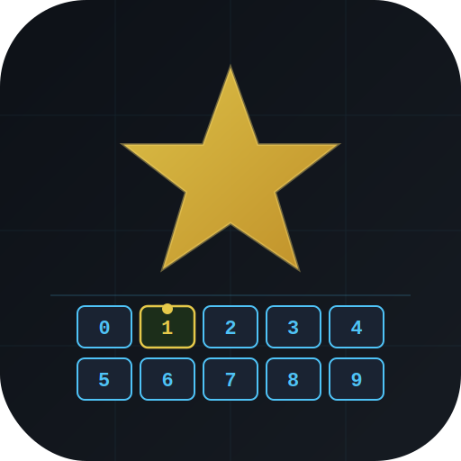

<p align="center">
  
</p>

# starmark.nvim

StarCraft-style marks for Neovim. Set marks on file positions with `Ctrl+{0-9}`, jump to them with `<leader>{0-9}`.

## Why?

- **Intuitive mental model** — RTS control group style: assign units (positions) to groups (slots), recall them instantly
- **10 slots** (0-9), not just 4
- **Persistent per-project** — marks survive across Neovim sessions
- **Built-in float UI** + picker support (Snacks.nvim, Telescope, fzf-lua)

## Install

With [lazy.nvim](https://github.com/folke/lazy.nvim):

```lua
{
  "gormanity/starmark.nvim",
  config = function()
    require("starmark").setup()
  end,
}
```

## Default Keybindings

| Key | Action |
|-----|--------|
| `Ctrl+0` – `Ctrl+9` | Set mark in slot 0-9 at current position |
| `<leader>0` – `<leader>9` | Jump to mark in slot 0-9 |
| `<leader>M` | Open mark picker |
| `<leader>mx` | Clear a mark (prompts for slot) |

## Configuration

```lua
require("starmark").setup({
  persistence = true,         -- save marks to disk
  project_root = nil,         -- auto-detect via git root, fallback to cwd
  marks_path = vim.fn.stdpath("data") .. "/starmark",
  keymaps = true,             -- set default keymaps
  notify = true,              -- show notifications on mark set/jump
  picker = "auto",            -- "auto" | "snacks" | "telescope" | "fzf-lua" | "builtin"
  ui = {
    width = 60,
    height = 12,
    border = "rounded",
  },
})
```

## Commands

- `:Starmark` / `:StarmarkPick` — open the mark picker
- `:StarmarkTelescope` — alias for `:StarmarkPick` (backward compat)

## Picker

`<leader>M` or `:Starmark` opens a picker. With `picker = "auto"` (default), the first available picker is used: Snacks.nvim → Telescope → fzf-lua → builtin float.

## Float UI

When using the builtin float picker, a floating window shows all marks. From the float:

- Press `0`-`9` to jump to that mark
- Press `q` or `<Esc>` to close

## API

```lua
local starmark = require("starmark")

starmark.set_mark(3)        -- set slot 3 at current cursor position
starmark.jump_to_mark(3)    -- jump to slot 3
starmark.clear_mark(3)      -- clear slot 3
starmark.clear_mark()       -- prompt for slot to clear
starmark.open_ui()           -- open float UI
starmark.toggle_ui()         -- toggle float UI
starmark.pick()              -- open picker (respects config.picker)
starmark.telescope()         -- alias for pick()
```
